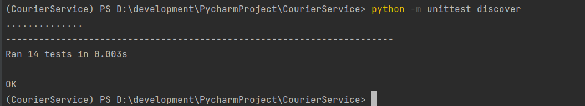

# CourierService

CourierService is a Python project for coding challenge.
This project didn't require any extra library. 
Unit test is using python default library [unittest](https://docs.python.org/3.10/library/unittest.html#module-unittest)


## Installation
Download and install python >= 3.10. Refer [Python 3.10.10](https://www.python.org/downloads/release/python-31010/)

## Usage
### Python basic usage
Check python version
```cmd
python -V
```
Execute python file
```cmd
python filename.py
```

### Execute Unit Test
Go to the folder CourierService and execute below command.
```cmd
python -m unittest discover
```
or with verbose the test detail.
```cmd
python -m unittest discover -v
```



### Execute Main Program
Go to the folder CourierService and execute below command.
```cmd
python main.py
```


## Config
### Edit the discount config
1. Go to the folder CourierService
2. Go to folder config
3. Edit the discount_config.json

## Sample Data
1. Base delivery cost: 100
2. Total package: 5
3. Packages:
   1. PKG1 50 30 OFR001
   2. PKG2 75 125 OFR008
   3. PKG3 175 100 OFR003
   4. PKG4 110 60 OFR002
   5. PKG5 155 95 NA
4. no_of_vehicles max_speed max_carriable_weigh: 2 70 200