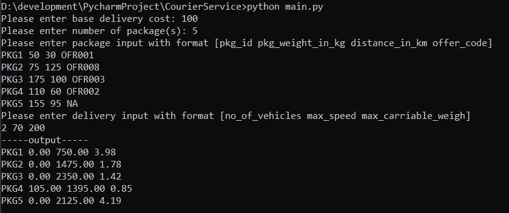
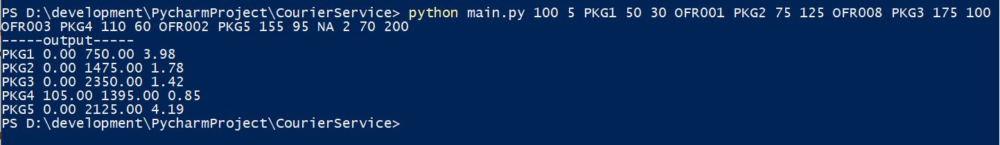

# CourierService

CourierService is a Python project for coding challenge.
This project didn't require any extra library. 
Unit test is using python default library [unittest](https://docs.python.org/3.10/library/unittest.html#module-unittest)


## Installation
Download and install python >= 3.10. Refer [Python 3.10.10](https://www.python.org/downloads/release/python-31010/)

## Usage
### Python basic usage
Check python version
```cmd
python -V
```
Execute python file
```cmd
python filename.py
```

### Execute Unit Test
Go to the folder CourierService and execute below command.
```cmd
python -m unittest discover
```
```cmd
Result
D:\development\PycharmProject\python-env\CourierService\Scripts\python.exe -m unittest discover 
...........................
----------------------------------------------------------------------
Ran 27 tests in 5.709s

OK

Process finished with exit code 0
```

or with verbose the test detail.
```cmd
python -m unittest discover -v
```
```cmd
Result
D:\development\PycharmProject\python-env\CourierService\Scripts\python.exe -m unittest discover -v 
test_20_package_delivery_estimate (test.test_delivery.TestDelivery) ... ok
test_30_package_delivery_estimate (test.test_delivery.TestDelivery) ... ok
test_delivery_estimate (test.test_delivery.TestDelivery) ... ok
test_delivery_estimate_when_pkg_weight_over (test.test_delivery.TestDelivery) ... ok
test_generate_package_delivery_list (test.test_delivery.TestDelivery) ... ok
test_invalid_input_delivery_estimate (test.test_delivery.TestDelivery) ... ok
test_invalid_input_generate_package_delivery_list (test.test_delivery.TestDelivery) ... ok
test_package (test.test_entities.TestEntities) ... ok
test_packages_shipment (test.test_entities.TestEntities) ... ok
test_invalid_input (test.test_fees.TestDeliveryCost) ... ok
test_valid_input (test.test_fees.TestDeliveryCost) ... ok
test_get_discount (test.test_fees.TestDiscount) ... ok
test_discount_cost (test.test_fees.TestDiscountCost) ... ok
test_invalid_input (test.test_fees.TestDiscountCost) ... ok
test_delivery_input (test.test_input.TestDeliveryCost) ... ok
test_float_input (test.test_input.TestDeliveryCost) ... ok
test_input_argument_float (test.test_input.TestDeliveryCost) ... ok
test_input_argument_float_negative (test.test_input.TestDeliveryCost) ... ok
test_input_argument_int (test.test_input.TestDeliveryCost) ... ok
test_input_argument_int_negative (test.test_input.TestDeliveryCost) ... ok
test_input_package (test.test_input.TestDeliveryCost) ... ok
test_input_package_negative (test.test_input.TestDeliveryCost) ... ok
test_int_input (test.test_input.TestDeliveryCost) ... ok
test_package_input (test.test_input.TestDeliveryCost) ... ok
test_package_input_without_code (test.test_input.TestDeliveryCost) ... ok
test_check_positive (test.test_tool.TestEntities) ... ok
test_decimal_truncate (test.test_tool.TestEntities) ... ok

----------------------------------------------------------------------
Ran 27 tests in 5.991s

OK

Process finished with exit code 0
```


### Execute Main Program
Go to the folder CourierService and execute below command.

#### Interactive mode
```cmd
python main.py
```


#### Single command line arguments

```cmd
python main.py base_delivery_cost no_of_packges pkg_id(x) pkg_weight(x)_in_kg distance(x)_in_km offer_code(x) no_of_vehicles max_speed max_carriable_weight
```
Sample
```cmd
python main.py 100 5 PKG1 50 30 OFR001 PKG2 75 125 OFR008 PKG3 175 100 OFR003 PKG4 110 60 OFR002 PKG5 155 95 NA 2 70 200
```


## Config
### Edit the discount config
1. Go to the folder CourierService
2. Go to folder config
3. Edit the discount_config.json

## Sample Data
### Interactive mode
1. Base delivery cost: 100
2. Total package: 5
3. Packages:
   1. PKG1 50 30 OFR001
   2. PKG2 75 125 OFR008
   3. PKG3 175 100 OFR003
   4. PKG4 110 60 OFR002
   5. PKG5 155 95 NA
4. no_of_vehicles max_speed max_carriable_weigh: 2 70 200

### Single command arguments
Format
```text
base_delivery_cost no_of_packges pkg_id(x) pkg_weight(x)_in_kg distance(x)_in_km offer_code(x) no_of_vehicles max_speed max_carriable_weight
```
Sample data
```text
100 5 PKG1 50 30 OFR001 PKG2 75 125 OFR008 PKG3 175 100 OFR003 PKG4 110 60 OFR002 PKG5 155 95 NA 2 70 200
```